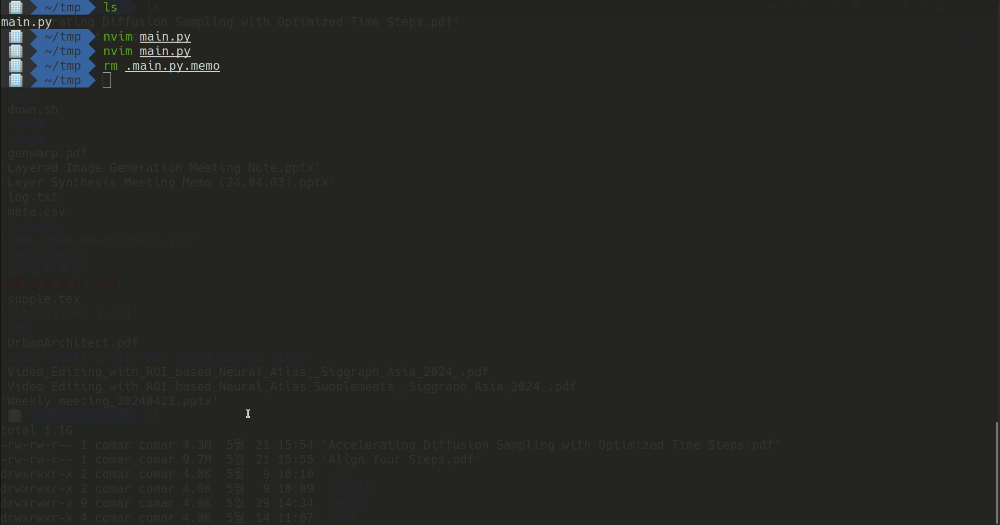

# Memo.nvim
 
Simple memo interface for a file.

 

## Installation

```lua
  use "KIMGEONUNG/memo.nvim"
``` 

## Usage

To start memo, execute `Memo` command as following:

```
:Memo<cr>
```
To save the memo and close the floating window, press `<ESC>` or `q` 
